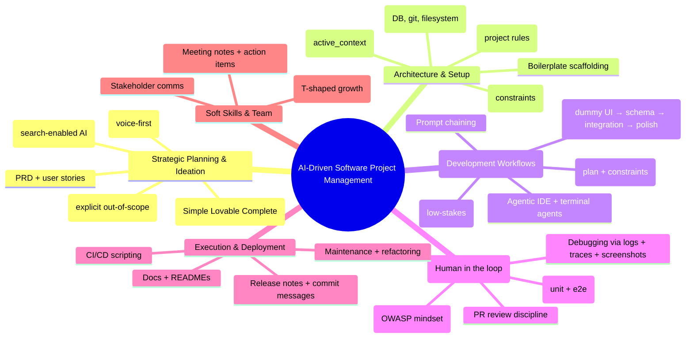

# AI_SWE_SWD_Project_Management_Playbook (SOP)
**Version:** 1.0  
**Last updated:** 2025-12-19 10:00 PM (Asia/Dhaka)  
**Scope:** Software Engineering (SWE) + Software Development (SWD) + R&D project management **using AI** (from ideation → delivery → maintenance).  
**Intent:** Keep AI productivity high while keeping engineering outcomes deterministic, secure, testable, and reviewable.

---

## 0) Operating principles (the “rules of the road”)
- **You are the Director.** AI writes faster; you decide architecture, risk, scope, and what “done” means.
- **Small batches win.** Sprint-sized tasks, reversible changes, frequent checkpoints.
- **Plan-gated execution.** No multi-file edits until the plan is approved.
- **Verification is part of definition-of-done.** Tests + type-check + lint + security review = non-negotiable.
- **Context is an asset.** Maintain a “memory layer” in-repo so the agent doesn’t drift between sessions.

---

## 1) Mind map (project management view)
> Paste into a Mermaid-enabled markdown viewer if you want the mind map rendered.



---

## 2) Tooling baseline (recommended stack of “AI helpers”)
### 2.1 Agentic editor + rules
- Use an agentic IDE/editor that can apply multi-file diffs **but** require plan approval first.
- Maintain repo-local **rules** / instructions so the agent follows your standards consistently.

**Cursor example:** Cursor supports a rules system stored in `.cursor/rules` (configured via Cursor settings).  
```text
Cursor rules docs:
https://cursor.com/docs/context/rules
```

### 2.2 “Memory layer” files (repo becomes the long-term brain)
Create these at repo root:
- `agents.md` — stable context: stack, architecture, style, gotchas
- `active_context.md` (or `memory.md`) — dynamic: decisions, current status, next steps
- `progress.md` — per-task compaction snapshot (what we did, what’s failing, what next)

### 2.3 MCP (Model Context Protocol) for “tool access” (optional but powerful)
If your AI tool supports it, use **MCP servers** to connect the agent to:
- filesystem navigation
- Git history / PRs
- Postgres/DB querying
- issue trackers / observability tools

```text
MCP spec + overview:
https://modelcontextprotocol.io/specification/2025-06-18
https://www.anthropic.com/news/model-context-protocol
```

### 2.4 Spec-driven development (when you want deterministic output)
Use spec-driven toolkits to lock requirements before code generation.

```text
GitHub Spec Kit:
https://github.com/github/spec-kit
GitHub blog intro:
https://github.blog/ai-and-ml/generative-ai/spec-driven-development-with-ai-get-started-with-a-new-open-source-toolkit/
```

---

## 3) The master lifecycle: Phases, goals, deliverables, checklists
### Phase 1 — Research & Ideation (The “What” and “Why”)
**Goal:** Validate problem-solution fit and define an SLC v1.0 (Simple, Lovable, Complete).

**Workflow**
1. Market gap scan (search-enabled AI): competitor map, pricing, weak UX in strong markets.
2. Voice-first brainstorming: pitch refinement; let AI challenge assumptions.
3. “Brutal critic” pass: ask for failure modes and missing constraints.
4. Define MVP + explicit NOT-in-scope list.
5. High-level user journey (happy path + top 3 failure paths).

**Deliverables**
- One-page concept brief
- SLC MVP scope + out-of-scope list
- Initial user personas + top user stories

**Checklist**
- [ ] Competitors + differentiators documented
- [ ] SLC scope defined + NOT-in-scope written
- [ ] User journey map drafted

---

### Phase 2 — Strategic Planning & Architecture (The “How” blueprint)
**Goal:** Prevent architecture hallucinations by pinning down requirements + interfaces + data model.

**Workflow**
1. Generate **PRD** (Product Requirements Document) and rewrite it in human language.
2. Design the data model (tables/entities + relationships + constraints).
3. Define APIs with a **narrow interface** principle (few endpoints, each does one thing).
4. Select tech stack based on constraints (cost, latency, team skill, compliance).
5. Define “quality gates” (testing, security, performance budgets).

**Deliverables**
- PRD v1
- Data model (ERD/table list) + key constraints
- API surface (endpoints/events) + versioning stance
- Architecture sketch (modules, boundaries)

**Checklist**
- [ ] PRD reviewed and signed off
- [ ] Schema/model defined with keys and constraints
- [ ] APIs listed (narrow, versioned)
- [ ] Tech stack finalized

---

### Phase 3 — Context & Environment Setup (The “Memory”)
**Goal:** Make the agent predictable across sessions and contributors.

**Workflow**
1. Create rules file(s): `.cursor/rules/*` or equivalent for your tool.
2. Initialize `agents.md` + `active_context.md` + `progress.md` templates.
3. Add “harness commands” (one-liners) for verification: tests, lint, typecheck.
4. (Optional) Connect MCP servers for DB/git/filesystem tooling.

**Deliverables**
- Repo rules file(s)
- Context/memory docs
- Verified local dev environment + scripts

**Checklist**
- [ ] Rules file created and enforced
- [ ] Memory files present and used
- [ ] Harness commands documented
- [ ] (Optional) MCP connected

---

### Phase 4 — Development Execution (The “Build”)
**Goal:** Maximize velocity without quality collapse.

**Two execution modes**
- **Vibe Prototype Mode (LOW-STAKES):** fast UI prototypes, throwaway branches, quick validation.
- **Engineering Mode (PRODUCTION):** plan-first, minimal diffs, tests, review gates.

**Recommended build workflow (UI-first waterfall)**
A. Build UI with dummy data  
B. Derive schema/backend from UI  
C. Connect frontend ↔ backend  
D. Polish interactions last (animations, microcopy, edge flows)

**Agentic workflow**
1. Plan: AI writes plan (files touched, functions, risks, tests) — **no code yet**
2. Approve plan
3. Execute in small diffs
4. Run harness
5. Review PR-style

**Checklist**
- [ ] Plan approved before edits
- [ ] Small diffs, scoped file edits
- [ ] Harness run after every change
- [ ] Checkpoints (commits/branches) created

---

### Phase 5 — QA, Security & Review (The “Verify”)
**Goal:** Treat AI output like it came from a capable intern on 3 coffees and 2 wrong assumptions.

**Workflow**
1. Security audit prompt (OWASP mindset): injection, authz, secrets, unsafe deps.
2. Test plan: unit + integration + e2e where needed.
3. Visual debugging: screenshots for UI; stack traces for backend.
4. Post-fix: regression test added for each bug.

**Deliverables**
- Test suite updates
- Security review notes
- Bug regression tests

**Checklist**
- [ ] OWASP-style security review completed
- [ ] Unit + integration tests passing
- [ ] E2E tests (if UI critical) passing
- [ ] Regression test added for every bug

---

### Phase 6 — Deployment, Release, Maintenance (The “Ship & Sustain”)
**Goal:** Automate boring work, keep releases predictable.

**Workflow**
1. Auto-docs: update README, runbooks, API docs.
2. CI/CD scripts: build, test, deploy, rollback.
3. Release checklist: version bump, migration steps, monitoring.
4. Post-deploy: measure error rates + performance, patch quickly.

**Deliverables**
- CI/CD pipeline
- Release notes
- Runbook + rollback instructions

**Checklist**
- [ ] Docs updated
- [ ] CI/CD verified
- [ ] Release notes produced
- [ ] Monitoring in place (errors + perf)

---

## 4) Roles, governance, and “human-in-the-loop” controls
### 4.1 Roles (lightweight RACI)
- **Director/Architect (you):** scope, architecture, risk acceptance, final review
- **AI Agent:** draft plans, write code, generate tests, generate docs, propose options
- **Reviewer:** diff review, security checklist, merges
- **Operator:** deploys, monitors, rollbacks

### 4.2 Approval gates (recommended defaults)
- **Must require approval:** schema migrations, auth changes, new dependencies, infra changes, multi-file refactors
- **Can run autonomously:** formatting, renames, doc updates, adding tests

---

## 5) Prompt templates (copy/paste)
### 5.1 PRD generator
```text
Generate a PRD for: <product>
Include: personas, user stories, non-goals, success metrics, risks, and a v1 “Simple Lovable Complete” scope.
Ask me up to 12 yes/no questions first.
```

### 5.2 Plan gate (no code)
```text
Write plan.md only (no code).
Include: files to touch, functions to add/change, edge cases, risks, test plan, rollback plan.
Stop and wait for approval.
```

### 5.3 Security audit
```text
Audit this change for OWASP-style risks:
- injection (SQL/command/template)
- auth/authz failures
- secrets leakage
- unsafe dependency usage
- insecure defaults
Return a checklist of findings + fixes.
```

### 5.4 Test-first (TDD)
```text
Write tests first for these scenarios: <I/O examples>.
Do not write implementation.
Stop after tests.
```

---

## 6) Metrics (so “progress” is real, not vibes)
- Lead time: ticket → merged
- Change failure rate: deploys causing incidents
- Mean time to recovery (MTTR)
- Test coverage for critical modules
- Bug regression rate (repeat incidents)
- Security findings per release

---

## Footnote
This playbook is a structured synthesis of the user-provided notes plus public documentationG references for MCP, agent rules, and spec-driven workflows.
